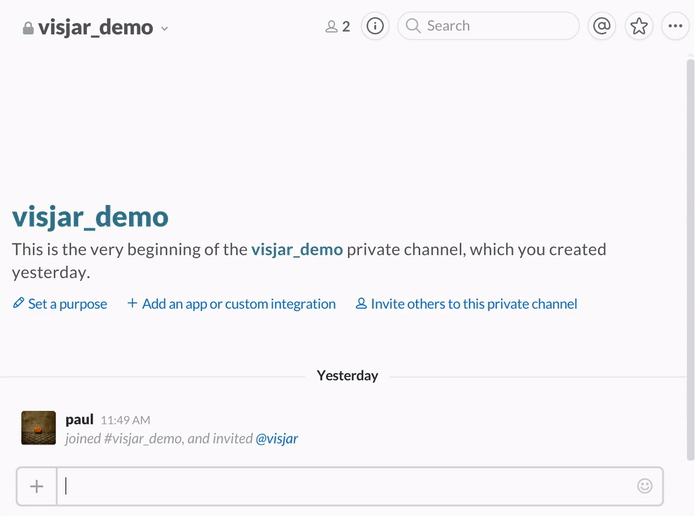
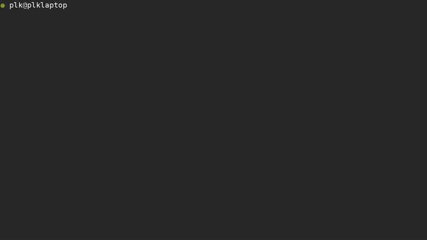

# Visjar

## Synospis

Visjar is a slack bot powered by Natural Language Understanding, which means that unlike other slackbots, this one is not only aware of simple unix-like commands, but can also understand sentences and complex requests.

## Installation

1. Get the project and move in the folder (`git clone git@github.com:recastAI/visjar.git && cd ./visjar`)
2. Create the parameters file from the .dist (`cp config/parameters.yml.dist config/parameters.yml`)
3. Add a new Slack integration under [services/new/bot](slack.com/services/new/bot) and copy the API token
4. Get the token from your `visjar` app on [Recast.AI](https://recast.ai)
5. Get a token from your [Google Console](https://console.developers.google.com/apis) for `Google Places API Web Service`, `Google Static Maps API`, `Google Maps Geocoding API` and `Custom Search API` (Optional)
6. Get a [Forecast.io](https://developer.forecast.io/) token (Optional)
7. Paste your tokens and fill your preferences in the parameters.yml file (`ed config/parameters.yml`)
8. Install the dependencies (`gem install bundler && bundle`)
9. Run the daemon (`./bin/visjar`)

## Usage

The workflow inside Visjar is as follows:

* Check if the message received is a **direct** message (via @visjar or as DM)
* If it is, send the message to [Recast.AI](https://recast.ai) to get the underlying **intent**
* If an intent is returned, send it to the corresponding **command**
* **Repeat**

Here's the list of the currently implemented commands:

* Salutations (Greetings, Goodbyes, Feelings, Thanks, Help)
* Weather cast
* Restaurant finding
* News
* Google search

## Configuration

Most of the configuration must be done in the `parameters.yml` file in order to have a default visjar working.
Visjar is relying on many APIs to provide you those commands, and here's a breakdown of what command uses which API:

The eat command uses Google Geocoding, Google Places and Google Static Maps.

The weather command works with Google Geocoding and Forecast.io.

The news command doesn't have an API dependency.

The search command relies on Google Custom Search.

All the commands Visjar can perform are situated in `lib/commands/` and are loaded during boot by the file `config/environment.rb`.
You can easily add a new command by creating a new file in the commands folder and add a requiring line in the environment file.

## Dependencies

* [Daemon-kit](https://github.com/RecastAI/daemonkit) and [safely](https://github.com/kennethkalmer/safely) are used to provide an easy daemon setup.
* [slack-ruby-client](https://github.com/dblock/slack-ruby-client), [faye-websocket](https://github.com/faye/faye-websocket-ruby), [HTTParty](https://github.com/jnunemaker/httparty) and [forecast_io](https://github.com/darkskyapp/forecast-ruby) are used to consume the APIs (RecastAI, Slack, Forecast.io, Google Places, Google Maps, etc.).
* [activesupport](https://github.com/rails/rails/tree/master/activesupport), [chronic](https://github.com/mojombo/chronic) and [time_difference](https://github.com/tmlee/time_difference) are used to do data processing.
* [awesome_print](https://github.com/michaeldv/awesome_print) is used for debugging.

## Contributing

1. Fork it
2. Create your feature branch (`git checkout -b feature/my-feature`)
3. Commit your changes (`git commit -am '[ADD] some feature'`)
4. Push to the branch (`git push origin feature/my-feature`)
5. Create new Pull Request

## Are you really going to read this?

Copyright (c) [2016] [Recast.AI](https://recast.ai)

Permission is hereby granted, free of charge, to any person obtaining a copy
of this software and associated documentation files (the "Software"), to deal
in the Software without restriction, including without limitation the rights
to use, copy, modify, merge, publish, distribute, sublicense, and/or sell
copies of the Software, and to permit persons to whom the Software is
furnished to do so, subject to the following conditions:

The above copyright notice and this permission notice shall be included in all
copies or substantial portions of the Software.

THE SOFTWARE IS PROVIDED "AS IS", WITHOUT WARRANTY OF ANY KIND, EXPRESS OR
IMPLIED, INCLUDING BUT NOT LIMITED TO THE WARRANTIES OF MERCHANTABILITY,
FITNESS FOR A PARTICULAR PURPOSE AND NONINFRINGEMENT. IN NO EVENT SHALL THE
AUTHORS OR COPYRIGHT HOLDERS BE LIABLE FOR ANY CLAIM, DAMAGES OR OTHER
LIABILITY, WHETHER IN AN ACTION OF CONTRACT, TORT OR OTHERWISE, ARISING FROM,
OUT OF OR IN CONNECTION WITH THE SOFTWARE OR THE USE OR OTHER DEALINGS IN THE
SOFTWARE.
